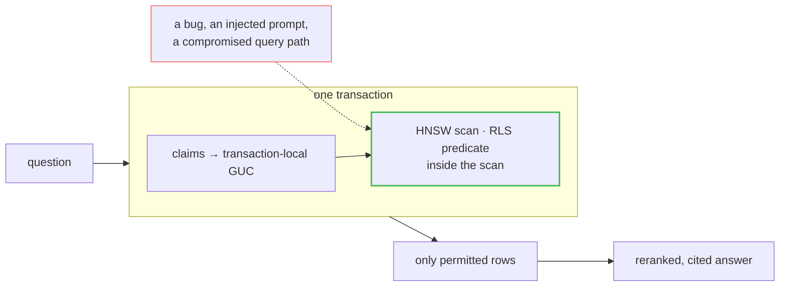

# gatekeeper-rag

**A permission-aware enterprise RAG platform where authorization is enforced inside the
database, not in application code.**

Most internal-chatbot demos answer questions well and handle access control by filtering
results in Python after retrieval. That is the wrong layer: a bug, an injected prompt, or
a compromised API process leaks documents. `gatekeeper-rag` pushes authorization into
Postgres row-level security, so the database itself refuses to return rows the caller is
not cleared to see — and the query layer connects as a role that *cannot* bypass it.

> **Status: v1.0 — all six phases complete.** Authorization, retrieval quality, agentic
> surface, platform and packaging. See [CHANGELOG.md](CHANGELOG.md) for what each phase
> delivered, [PROJECT_PLAN.md](PROJECT_PLAN.md) for the original roadmap, and
> [THREAT_MODEL.md](docs/THREAT_MODEL.md) for what is still weak.



The restricted row never leaves Postgres. More: [request path](docs/diagrams/request-path.md) ·
[the decision](docs/diagrams/authorization.md) · [ingestion](docs/diagrams/ingestion.md) ·
[trust boundaries](docs/diagrams/trust-boundaries.md).

<!-- Walkthrough video: record from docs/DEMO_SCRIPT.md, then link the unlisted YouTube URL here. -->

## Results

| | |
|---|---|
| Leaks across 360 adversarial probes + 6 direct-fetch + 8 boundary probes | **0** |
| (principal, chunk) pairs where the database and an independent oracle disagree | **0 of 442,782** |
| Over-block rate (entitled results withheld) | **1.15%** |
| nDCG@10 on 58 hand-written questions (`dense+rerank`) | **0.793** ±0.003 |
| Retrieval latency p50, dense / dense+rerank | **8 ms / 205 ms** |
| Recall@10 vs exact brute force, `ef_search=200` | **1.000** |
| RLS-filtered ANN throughput, 64 concurrent, auditing on | **1,207 q/s** |
| Indirect injections that reached the model and widened access | **0 of 13** |

The authorization numbers come from [`src/gatekeeper/redteam/`](src/gatekeeper/redteam/),
which scores the SQL policy against a **separate Python implementation of the same written
spec**. Asking the database whether the database got it right proves nothing; two
implementations disagreeing loudly is the point. Retrieval numbers are in
[`docs/BENCHMARKS.md`](docs/BENCHMARKS.md), measured against exact brute-force ground truth.

Retrieval quality is in [`docs/ABLATION.md`](docs/ABLATION.md), measured over 58
hand-written questions labelled against real documents — never generated from chunk text,
which would make the eval circular and hand lexical search a win by construction.

**The most useful results in this project are negative**, and they are reported as
prominently as the positive ones:

- **The most restricted users were the slowest** — 36× — because below a selectivity
  threshold Postgres abandons the vector index, and nothing in the results indicates it.
  Fixed, 79 ms → 2.0 ms. But 13× of that 40× came from a change made weeks earlier for an
  unrelated reason, and this ADR's own proposed fix was on the wrong axis
  ([ADR 0006](docs/adr/0006-filtered-ann-and-index-selectivity.md)).
- **Hybrid search does not pay on this corpus** and is off by default. Across four runs it
  finished ahead of `dense+rerank` twice and behind it twice — every gap inside the noise
  band — while costing 66% more latency
  ([ADR 0008](docs/adr/0008-hybrid-search-measured-and-disabled.md)).
- **The semantic layer of the injection classifier was built, measured, and deleted.** It
  contributed nothing, and the measurement shows it could not have worked at any threshold
  ([ADR 0010](docs/adr/0010-injection-detection-is-the-second-line.md)).
- **Embedding similarity cannot see numbers.** A groundedness check built on it alone rates
  a tenfold error in an expense limit as supported — in a corpus that is nothing but
  thresholds ([ADR 0012](docs/adr/0012-groundedness-needs-two-layers.md)).
- **Turning the audit chain off made tail latency three times *worse*.** Throughput rose
  45%, p99 went from 361 ms to 992 ms: the advisory lock had been pacing the pipeline
  ([ADR 0016](docs/adr/0016-the-bottleneck-is-the-embedder.md)).
- **Re-running the ablation invalidated two of its own supporting claims.** The fused arm
  spans 0.021 across runs where every other arm spans ≤0.003, and "bigger candidate pools
  are worse" turned out to be an artifact of measuring once
  ([ADR 0008](docs/adr/0008-hybrid-search-measured-and-disabled.md#re-measured)).

And two bugs found by testing rather than reading:

- A performance fix to the ABAC predicate caused a *correctness* regression — retrieval
  returned zero results for a principal who could plainly `SELECT` two matching rows
  ([ADR 0007](docs/adr/0007-explicit-claims-not-ambient-session-state.md)).
- **A background job reported `succeeded` while silently failing to index a document**,
  because `index_one` returned the same value for "unchanged" and "the file is gone". Found
  by hiding a source file and watching the job pass
  ([ADR 0014](docs/adr/0014-jobs-are-rows-not-just-messages.md)).

Three of these are written up at length in [`docs/writeups/`](docs/writeups/).

---

## Quickstart

Requires Docker and [uv](https://docs.astral.sh/uv/). No API keys needed.

```bash
make install     # venv + dependencies
make bootstrap   # infra up, migrations, fetch corpus, seed with derived ACLs
make test-all    # includes the RLS isolation tests
```

`make bootstrap` clones the [GitLab Handbook](https://gitlab.com/gitlab-com/content-sites/handbook)
(4,586 Markdown files, MIT-licensed), overlays a plausible enterprise access model onto its
real departmental structure, chunks and embeds it locally, and loads it into Postgres.
Answer *generation* is the one feature that needs an API key; without one the CLI does
retrieval and says so.

## Use it from Claude Code

The repo ships a [`.mcp.json`](.mcp.json), so an MCP client in this directory picks the
server up directly:

```bash
make mcp WHO=raj      # or edit GK_MCP_PRINCIPAL in .mcp.json
```

Three tools — `search_knowledge_base`, `get_document`, `whoami` — all going through the
same row-level security policy as the CLI and the console, with no agent-specific code
path. Ask the same question as two principals and the difference is visible in the answers:

```text
raj   → Searched as Raj Mehta — Backend Engineer (clearance 1).
        3 additional match(es) exist that this principal is not authorised to read.
        1. handbook/eba/_index.md                    internal
        2. handbook/communication/ask-me-anything.md public

mira  → Searched as Mira Lindqvist — CFO (clearance 3).
        1. handbook/people-group/…/leave-types.md    restricted
        2. handbook/leadership/compensation-review-conversations.md  restricted
```

Two rules the tool output follows, both about what a model will do with what you hand it
([ADR 0009](docs/adr/0009-mcp-surface-and-one-principal-per-process.md)):

- **A withheld result is a count, never an identity.** Hand a model the *title* of a
  withheld document and it will write that title into its answer — and for restricted
  material the title is usually the secret.
- **`get_document` returns byte-identical responses for an unreadable path and a
  nonexistent one.** Distinguishing them turns the tool into an oracle for enumerating the
  corpus by probing paths.

The server binds to **one principal for its lifetime**, set at launch. Unlike the console
below, no tool takes a principal argument — so no prompt injection can ask for a different
one.

## The console

```bash
make ui          # http://127.0.0.1:8077
```

Pick one or more principals, ask a question, and see the same query answered from
different corpora. Each column shows what that principal retrieved, how many results
authorization removed, and the sensitivity of every source.

The sharpest thing it makes visible: ask *"How do I report a security incident?"* as Sam
(security engineer, clearance 1) and Mira (CFO, clearance 3), and Sam gets a `restricted`
incident-response guide that Mira does not. **Clearance is a ceiling, not a key** — a high
clearance without the right group grants nothing.

> Sign-in mints a real bearer token — verified signature, issuer, audience and expiry. In
> `dev` mode the endpoint that issues it asks for no password, which is what
> `GK_AUTH_MODE=dev` means; set `GK_AUTH_MODE=oidc` and it disappears. Impersonation is a
> claim on the token, refused with a 403 without it, and audited under the real principal
> ([ADR 0013](docs/adr/0013-tokens-assert-identity-not-entitlement.md)).

## The demo

Same question, same corpus, same ranking function — two principals:

```console
$ make ask Q="What is the board meeting cadence and who attends?" WHO=raj
asked as Raj Mehta — Backend Engineer  clearance=1 groups=all-employees, engineering
5 sources in 58 ms · 1 withheld by authorization

  #  score  sensitivity  source
  1  0.701  public       Cadence — Overview > Quarter
  2  0.662  public       Cadence — Overview > Week
  ...

$ make ask Q="What is the board meeting cadence and who attends?" WHO=mira
asked as Mira Lindqvist — CFO  clearance=3 groups=all-employees, finance, executives
5 sources in 53 ms

  #  score  sensitivity  source
  1  0.701  public       Cadence — Overview > Quarter
  2  0.677  restricted   CEO — Why I'm at GitLab > CEO Meeting Cadence   ← only Mira
  ...
```

Raj is not filtered out of a list he was shown. The row never leaves Postgres.

## What it does

<details>
<summary><b>Authorization</b> — ABAC in one SQL function, verified against an independent implementation</summary>

- **One decision function.** `gatekeeper.authorize()` enforces tenant, expiry, deny rules, clearance, group overlap, need-to-know and jurisdiction. Both the `documents` and `chunks` policies call it, so they cannot drift apart.
- **Need-to-know is subset, not overlap** — a chunk tagged `{pii, compensation}` requires both grants. **Deny beats allow**, and deny rules live in a table as data, so a litigation hold is an `INSERT` rather than a deploy.
- **Chunk-level overrides can only tighten**: clearance and sensitivity take the maximum, tags union, groups intersect. A malformed override cannot grant access.
- **Hash-chained audit log**, written in the same transaction as the query it describes. Tamper detection tested by editing and deleting rows.
- **Split-privilege connections**: queries run as `gatekeeper_app` (`NOSUPERUSER`, `NOBYPASSRLS`); policies are `FORCE`d so even the owner is subject to them.
- **Claims in a transaction-local GUC**, so authorization context cannot leak across pooled connections.

</details>

<details>
<summary><b>Retrieval</b> — measured over a hand-written golden set, with the stages that didn't pay reported too</summary>

- **Structure-aware chunking**: heading hierarchy prefixed onto every chunk, tables and code fences atomic, sentence-boundary splits for prose.
- **Dense retrieval with the ACL predicate inside the vector scan** — `halfvec` HNSW indexes on the same relation as the RLS policy, so ranking and authorization are one scan.
- **Cross-encoder reranking**: +9% MRR, +6% nDCG. The only unambiguous win of the retrieval phase.
- **Lexical retrieval and RRF**, both under the same policy — built, measured, and off by default.
- **Partial HNSW indexes per sensitivity tier**, which closed the selectivity cliff.
- **58-question golden set** with a validation pass that fails the run if any label is unreachable, and published variance bands.

</details>

<details>
<summary><b>Agentic surface</b> — MCP, injection containment, caching, groundedness</summary>

- **MCP server** over stdio with three tools and no separate query path, so the red-team suite covers it without re-testing. One principal per process, bound at launch.
- **Withheld results are counts, never identities** — hand a model the title of a withheld document and it writes that title into its answer. **`get_document` returns byte-identical responses for unreadable and nonexistent paths**, so it cannot be used to enumerate the corpus.
- **Injection detection** at a 0.004% false-positive rate, scored at ingest and re-scorable in 15 seconds without re-embedding. Flagged sources are annotated for the model, never silently withheld.
- **Query cache keyed by entitlement**, storing chunk *ids* so every hit is re-authorized: 267 ms → 12 ms.
- **Groundedness in two layers** — similarity, plus an exact numeric check for what similarity cannot see.

</details>

<details>
<summary><b>Platform</b> — auth, background work, tracing, load</summary>

- **Bearer tokens** (HS256 dev / RS256 OIDC) that establish a *subject* and nothing else; entitlements are read from the database every request.
- **Background ingestion** over arq where the queue message carries only a job id and all state lives in a row, with per-document failure isolation and targeted retry.
- **Tracing whose spans carry shapes, never contents** — enforced by a test that walks the AST of every module.
- **Concurrency sweep with a control arm** that identifies the real bottleneck.

</details>

## The access model

ABAC, not plain RBAC. A request carries `groups`, `clearance`, `department`, `region`, and
an optional expiry; a document carries `sensitivity`, `allowed_groups`, `min_clearance`,
`need_to_know_tags`, and `jurisdiction`.

| Handbook subtree | Sensitivity | Clearance | Groups |
|---|---|---|---|
| `board-meetings/`, `ceo/`, `leadership/` | restricted | executive | `executives` |
| `total-rewards/compensation/`, `stock-options.md` | restricted | manager | `people-ops`, `comp-committee` |
| `people-policies/{france-sas,inc-usa,india-ltd,…}` | confidential | employee | + region-scoped |
| `security/security-operations/` | restricted | employee | `security` |
| `legal/`, `acquisitions/` | confidential | manager | `legal`, `executives` |
| `values/`, `company/`, `communication/` | public | — | anyone |

Compensation, board material, and per-country employment policy are content that plausibly
*should* be restricted at a real company, which is what makes the denial demos meaningful
rather than contrived.

## Architecture

```
src/gatekeeper/
├─ core/        principals, models, RLS-aware session management
├─ ingest/      ACL derivation, chunking, blobs, pipeline
├─ retrieval/   dense · lexical · RRF · config-driven pipeline
├─ llm/         embeddings, generation, provider abstraction
├─ evals/       golden set, ablation, filtered-ANN benchmark
├─ redteam/     independent oracle + adversarial corpus
└─ apps/        api · worker · mcp
```

| | |
|---|---|
| [`docs/adr/`](docs/adr/) | 16 decision records, including the ones that turned out wrong |
| [`docs/diagrams/`](docs/diagrams/) | Request path, the decision, ingestion, trust boundaries |
| [`docs/THREAT_MODEL.md`](docs/THREAT_MODEL.md) | Assets, six adversaries, evidence per mitigation, and what is out of scope |
| [`docs/ABLATION.md`](docs/ABLATION.md) · [`BENCHMARKS.md`](docs/BENCHMARKS.md) · [`LOAD.md`](docs/LOAD.md) | Generated, not hand-written |
| [`docs/writeups/`](docs/writeups/) | Three long-form pieces on the results that surprised me |
| [`CHANGELOG.md`](CHANGELOG.md) | Per phase: what was added, measured, and **disproved** |

## License

MIT. The handbook corpus is MIT-licensed by GitLab B.V. and is fetched at build time, not
vendored.
