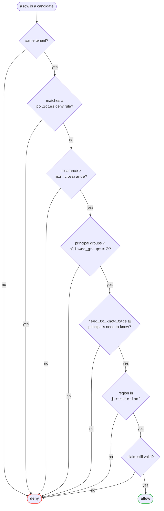
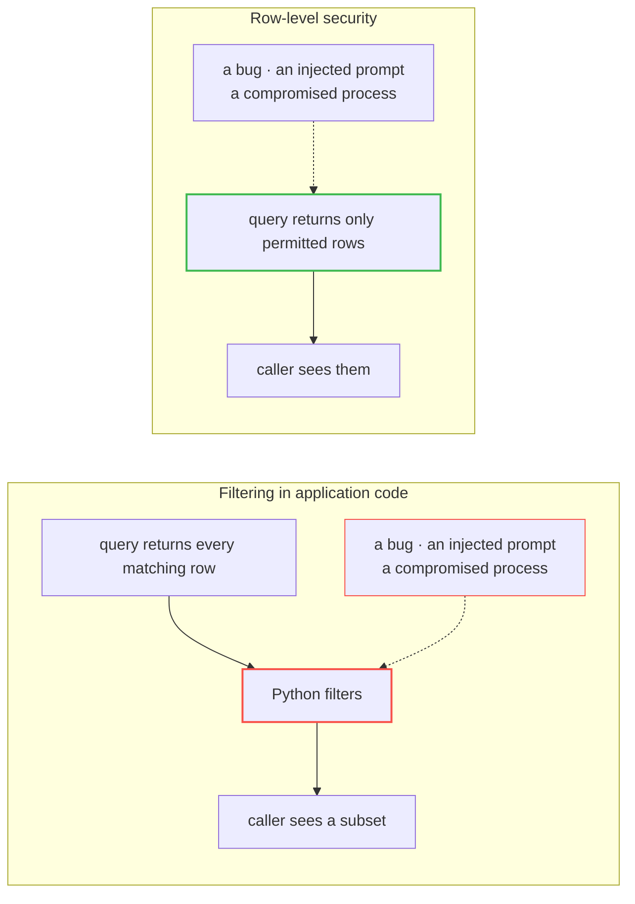

# The decision

Every read in this system passes one SQL function. This is what it reads and in what
order.

**Deny is evaluated before allow**, and nothing later can overturn it. A deny rule is a
row in `policies`, not code — adding one is a data change, and the red-team suite reads
the same rows to build its independent expectation.

**Need-to-know is a subset test, not an intersection.** The document names what you must
hold; holding *some* of it is not enough. This is the one clause most often implemented
backwards, and getting it wrong grants rather than denies.

**Clearance is a ceiling, not a key.** Passing the clearance gate grants nothing on its
own — the group test still has to pass. The sharpest demo in the console rests on this: a
CFO at clearance 3 cannot read a `restricted` security runbook that a clearance-1 security
engineer can, because clearance was never the thing that granted it.

## Why it lives in the database

In the left arrangement the restricted row **left the database** and was in process memory
before anything decided it should not have. Every bug between the query and the filter is
a disclosure, and the audit log records a read that returned rows nobody was entitled to.

In the right arrangement the row never leaves Postgres. The query layer connects as
`gatekeeper_app` — `NOSUPERUSER`, `NOBYPASSRLS` — so it *cannot* opt out, and policies are
`FORCE`d so even the table owner is subject to them.

The claims arrive in a **transaction-local** GUC set with `set_config(..., true)`. Under
connection pooling a session-scoped variable would outlive its request and answer the next
caller's query with the previous caller's entitlements. Transaction-local cannot.
