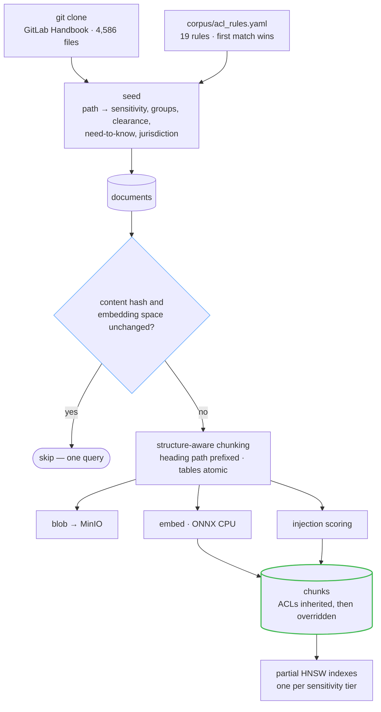
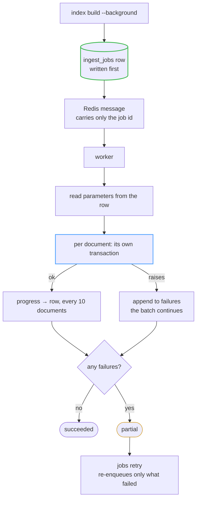

# Ingestion

4,586 Markdown files to 73,801 authorized, embedded chunks. The access model is
**derived from the corpus's own structure**, not hand-labelled per document.

**ACLs are columns on `chunks`, not a join.** The RLS policy and the vector index live on
the same relation, so ranking and authorization are one scan rather than a filter applied
to the output of one ([ADR 0004](../adr/0004-embedding-columns-on-chunks.md)).

**The rules file is the access model.** 19 path patterns, first match wins, reviewable
without reading Python. Three chunk-level overrides handle the case a path rule cannot:
a compensation table inside an otherwise-internal handbook page.

**The skip check is what makes iteration affordable.** Change a chunking parameter and
pass `--force`; change nothing and re-running the whole corpus costs one query per
document.

## Background jobs

The row is written **before** the message. A crash between the two leaves a visible
`queued` job; the other order leaves work running that nothing knows about.

The message carries **only an id**. An operator debugging a stuck reindex answers "what is
it doing and how far has it got" with a `SELECT`, not by decoding a Redis value that the
incident may already have flushed ([ADR 0014](../adr/0014-jobs-are-rows-not-just-messages.md)).

Failure isolation is **a transaction boundary, not a `try` block**. One transaction around
the loop would still roll back every committed document when a later one failed — which is
exactly how the foreground path used to lose twenty-five minutes of work to a single bad
blob upload.
