# Request path

One question, from a caller to an answer. The thing worth reading off this diagram is
**where the dashed box is**: authorization is not a step in the pipeline, it is a property
of the transaction every step runs inside.

```mermaid
flowchart TB
    CLI["CLI"] --> LOAD
    UI["Console"] --> AUTH["auth.verify<br/>signature · issuer · audience · expiry"] --> LOAD
    MCP["MCP client"] --> LOAD
    LOAD["load_principal<br/>groups · clearance · need-to-know"]

    LOAD --> EMB["embed query"] --> CACHE{"query cache"}

    subgraph txn["principal_session — one transaction"]
        direction TB
        GUC["set_config('gatekeeper.principal', …, true)"]
        ANN["HNSW scan over halfvec<br/>RLS predicate inside the scan"]
        AUDIT["append to hash-chained audit log"]
        GUC --> ANN --> AUDIT
    end

    CACHE -- miss --> GUC
    CACHE -- "hit: chunk ids only" --> GUC
    AUDIT --> RERANK["cross-encoder rerank"] --> GEN["generate + verify groundedness"]

    style txn fill:#0d1117,stroke:#f85149,stroke-width:2px,stroke-dasharray: 6 4
    style ANN stroke:#f85149,stroke-width:2px
    style GUC stroke:#f85149,stroke-width:2px
```

**Three things this makes visible.**

**A token shrinks as it crosses into the system.** `auth.verify` establishes a *subject*
and nothing more; `load_principal` reads groups, clearance and need-to-know from Postgres
on every request. A forged claim cannot invent an entitlement that was never granted. The
CLI and MCP paths skip verification because they are local processes, not network
surfaces — the principal they load is still the database's answer, not their own.

**The cache hit and the cache miss converge on the same box.** An entry stores chunk
*ids*, never content, so a hit re-enters the authorized transaction and the policy runs
again. A poisoned cache entry pointing at a restricted chunk still returns nothing; the
worst case degrades to a wasted lookup.

**The audit write is inside the transaction**, and reranking is outside it. The record and
the read it describes commit together or neither does. Reranking only reorders rows the
policy already returned — no stage downstream of the scan can widen what a principal sees,
which is why the red-team suite covers the MCP server without re-testing it.
