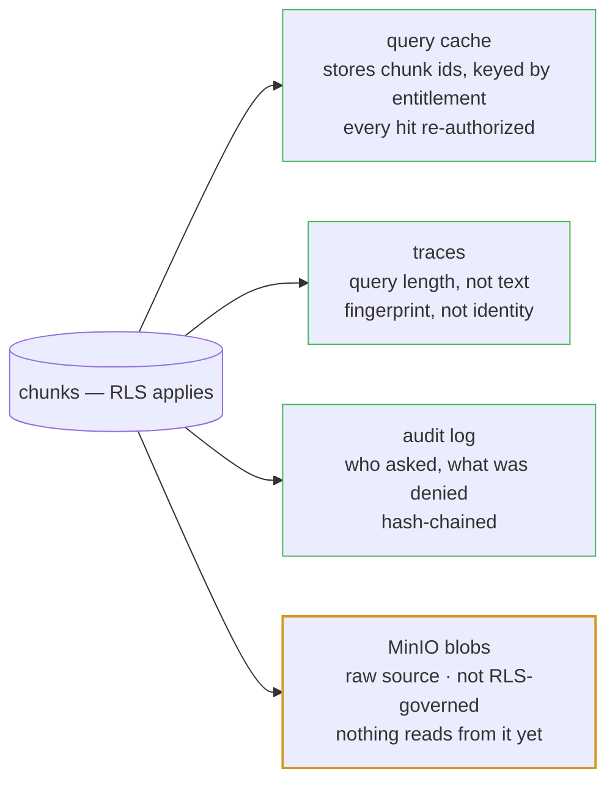

# Trust boundaries

What this system trusts, what it does not, and what crosses between them. The companion
prose is [`docs/THREAT_MODEL.md`](../THREAT_MODEL.md).

```mermaid
flowchart TB
    subgraph untrusted["UNTRUSTED — attacker-influenced"]
        Q["query text"]
        DOC["document content"]
        TOK["bearer token"]
        MODEL["LLM output"]
    end

    subgraph semi["VERIFIED — trusted only after checking"]
        VTOK["subject — and nothing else"]
    end

    subgraph trusted["TRUSTED — the authority"]
        PG[("Postgres<br/>principals · ACLs · policies")]
        GUC["gatekeeper.principal<br/>transaction-local GUC"]
        RLS["RLS policy<br/>FORCEd, on an unprivileged role"]
        PG --> GUC --> RLS
    end

    TOK -->|"signature, issuer,<br/>audience, expiry"| VTOK
    VTOK -->|"look up entitlements"| PG
    Q -.->|"embedded; never reaches the policy"| RLS
    DOC -.->|"scored, annotated, never obeyed"| MODEL
    MODEL -.->|"cannot write the GUC"| GUC

    style untrusted fill:#1a1113,stroke:#f85149,stroke-width:2px
    style trusted fill:#0f1a12,stroke:#3fb950,stroke-width:2px
    style semi fill:#1a1710,stroke:#d29922,stroke-width:2px
    style RLS stroke:#3fb950,stroke-width:2px
```

**The dotted arrows are the claim.** A query is embedded and compared; it never becomes
part of the authorization decision. A poisoned document can persuade the model of
anything, and the model still cannot write the GUC that determines what the next query
returns. That is why containment is measured separately from detection, and why it holds
for the payloads the classifier misses ([ADR 0010](../adr/0010-injection-detection-is-the-second-line.md)).

**A token crosses one boundary and shrinks doing it.** What survives verification is a
subject. Groups, clearance, need-to-know and region are read from Postgres on every
request, so a forged claim cannot invent an entitlement that was never granted
([ADR 0013](../adr/0013-tokens-assert-identity-not-entitlement.md)).

## Where copies of the corpus can appear

The authorization model governs `chunks`. Anything that makes a *second* copy escapes it
unless deliberately designed not to — and each of these was.

The blob store is the honest gap. It holds the raw handbook — which is public — and
nothing in the read path consults it; the git clone is the source of truth. If it ever
serves content, it needs its own authorization, and that is recorded rather than glossed.
